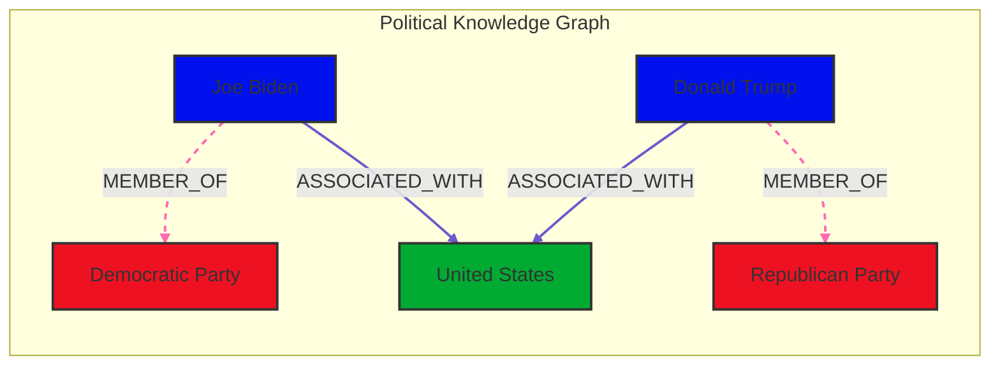

# Political Knowledge Graph Builder

This project utilizes Wikipedia, OpenAI's GPT-4 Turbo, and Neo4j to construct a comprehensive knowledge graph of political figures, their affiliations, and associated countries or states. By fetching structured data from Wikipedia and leveraging advanced language models, the system dynamically populates a Neo4j database with detailed nodes and relationships representing political entities and their interactions.

## Project Overview

The primary objectives of this project are to:
1. **Fetch political entities** from Wikipedia articles using the `wikipedia` Python package.
2. **Extract structured data** from the fetched content using OpenAI's GPT-4 Turbo.
3. **Clean and deduplicate** the extracted data to ensure consistency and accuracy.
4. **Populate a Neo4j knowledge graph** with entities (nodes) and relationships to represent these associations in a structured format.

The project aims to simplify the creation of a knowledge graph with minimal setup and automated data processing, eliminating the need for extensive manual data cleaning or prompt engineering.

## Requirements

- **Python 3.8+**
- **Neo4j Database** (Community or Enterprise Edition)
- **OpenAI API Key** (access to OpenAI's GPT-4 Turbo)
- **Environment Variables** (managed via a `.env` file)
- **Python Libraries**:
  - `neo4j` (for connecting to Neo4j)
  - `openai` (OpenAI client)
  - `wikipedia` (for fetching Wikipedia content)
  - `python-dotenv` (for loading environment variables)
  - `re`, `json`, `logging`, `dataclasses`, `enum` (Python standard libraries)

## Installation

1. **Clone this repository**:
    ```bash
    git clone https://github.com/your-username/political-knowledge-graph.git
    cd political-knowledge-graph
    ```

2. **Create and activate a virtual environment** (optional but recommended):
    ```bash
    python3 -m venv venv
    source venv/bin/activate
    ```

3. **Install the required libraries**:
    ```bash
    pip install -r requirements.txt
    ```

4. **Set Up Environment Variables**:
    - Create a `.env` file in the project root with the following content:
      ```
      NEO4J_CONNECTION_URL=bolt://localhost:7687
      NEO4J_USER=your_neo4j_username
      NEO4J_PASSWORD=your_neo4j_password
      OPENAI_API_KEY=your_openai_api_key
      ```
    - Replace the placeholders with your actual credentials.

5. **Ensure Neo4j is running**:
    - Start your Neo4j instance locally or ensure it is accessible via the specified URI (`bolt://localhost:7687` by default).

## Usage

1. **Prepare Wikipedia Article Titles**:
   - Modify the `titles` list in the `main` function with the Wikipedia articles you wish to process. Example:
     ```python
     titles = [
         "Donald Trump",
         "Joseph R. Biden",
         "Kamala Devi Harris",
         "Andrzej Duda",
         "Volodymyr Zelenskyy",
         "Vladimir Vladimirovich Putin",
         "People's Republic of China",
     ]
     ```

2. **Run the Script**:
    ```bash
    python from_neo4j_import_GraphDatabase.py
    ```

3. **View the Graph**:
   - After running the script, open the Neo4j Browser (usually at `http://localhost:7474`) to visualize the knowledge graph.
   - Nodes will represent political figures, organizations, locations, etc., and relationships will depict their affiliations and associations.

## Code Structure

- **WikiKnowledgeGraph**: The main class responsible for managing the Neo4j database, interacting with OpenAI's API to extract and structure knowledge graph data.
  - `__init__`: Initializes Neo4j and OpenAI connections.
  - `fetch_wikipedia_content`: Retrieves content from Wikipedia articles.
  - `extract_structured_data`: Uses OpenAI's GPT-4 Turbo to extract entities and relationships from text.
  - `process_article`: Orchestrates the fetching and extraction process for each article.
  - `aggregate_json`: Aggregates JSON data from all processed articles.
  - `clean_aggregated_json`: Cleans and deduplicates the aggregated JSON using OpenAI's GPT-4 Turbo.
  - `create_graph_from_cleaned_data`: Populates the Neo4j database with the cleaned data.
  - Helper functions like `try_repair_json` and `parse_json_response` handle JSON parsing and error recovery.

## Example Output

After running the script with the example titles, you should see nodes and relationships similar to the following:



## Troubleshooting

1. **No JSON content found in the response**:
   - Ensure that OpenAI's API key is correctly set in the `.env` file.
   - Verify that the prompts are correctly formatted and that the input text contains extractable information.

2. **Neo4j connection errors**:
   - Confirm that Neo4j is running and accessible at the specified URI (`bolt://localhost:7687`).
   - Check that your Neo4j credentials (`NEO4J_USER` and `NEO4J_PASSWORD`) are correct.

3. **OpenAI API Errors**:
   - Ensure that your OpenAI API key (`OPENAI_API_KEY`) is valid and has sufficient permissions.
   - Monitor your API usage to avoid exceeding rate limits.

4. **Wikipedia Fetching Issues**:
   - Verify that the article titles are correct and exist on Wikipedia.
   - Ensure that the `wikipedia` Python package is functioning properly.

## License

This project is licensed under the MIT License. See the [LICENSE](LICENSE) file for details.
